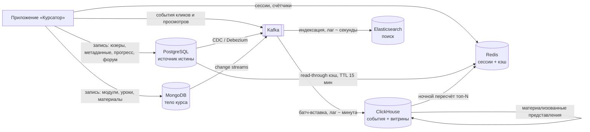

# Этап 4. Синхронизация и потоки данных

## Схема потоков



## Шаблон «сущность → источник → механизм → производное хранилище»

```
Профиль пользователя  → PostgreSQL → read-through + инвалидация по UPDATE → Redis (TTL 15 мин)
Карточка курса        → PostgreSQL + MongoDB → событие course.published → Redis (TTL 1 ч)
Курс (поиск)          → PostgreSQL + MongoDB → CDC → Kafka → индексация → Elasticsearch
Прогресс              → PostgreSQL → write-through при отметке урока → Redis (TTL 5 мин)
Лайки форума          → Redis (INCR) → фоновый сброс раз в минуту → PostgreSQL
События               → Приложение → Kafka → батч-вставка раз в минуту → ClickHouse
Справочники           → PostgreSQL → CDC / ночная выгрузка → ClickHouse (словари)
Витрины отчётов       → ClickHouse (события + словари) → материализованные представления → ClickHouse
Рекомендации          → ClickHouse (ночной GROUP BY по событиям) → загрузка топ-20 → Redis (ZSET)
```

## Что является источником истины

| Сущность | Источник истины | Производные копии |
|---|---|---|
| Пользователи | PostgreSQL | Redis (кэш), ClickHouse (словарь) |
| Сессии | Redis | — |
| Refresh-токены | PostgreSQL | — |
| Метаданные курса | PostgreSQL | Redis, Elasticsearch, ClickHouse (словарь) |
| Тело курса | MongoDB | Redis, Elasticsearch |
| Прогресс | PostgreSQL | Redis (кэш позиции) |
| Форум | PostgreSQL | Redis (счётчики) |
| События | ClickHouse | витрины внутри ClickHouse |
| Поисковый индекс | **нет** — производное | — |
| Витрины и отчёты | **нет** — производное | — |
| Рекомендации | **нет** — производное | Redis (витрина чтения) |

Правило, которого держимся: **у производного хранилища не бывает своего источника истины.**
Если его содержимое потеряно — оно пересобирается из источника, а не восстанавливается из бэкапа.

## Как данные попадают из источника в производные хранилища

**Кэш (Redis) — read-through + инвалидация по событию.**
Читаем: нет в Redis → берём из PostgreSQL → кладём с TTL. Пишем: сначала PostgreSQL,
затем `DEL` ключа (именно удаление, а не перезапись — иначе две параллельные записи
оставят в кэше проигравшую версию). TTL остаётся страховкой на случай потерянной инвалидации.

**Поисковый индекс (Elasticsearch) — CDC через Kafka.**
Изменения в PostgreSQL и MongoDB читает Debezium и кладёт в Kafka, консьюмер собирает
денормализованный документ курса и отправляет в Elasticsearch. Отставание — секунды.
Раз в сутки — сверка контрольных сумм и переиндексация расхождений.

**Аналитика (ClickHouse) — поток событий + реплика справочников.**
События идут через Kafka и вставляются пачками раз в минуту: ClickHouse плохо переносит
частые мелкие INSERT, ему нужны крупные батчи. Справочники (пользователи, курсы) приезжают
как словари ClickHouse и обновляются ночью — join событий со справочником делается уже внутри
ClickHouse, без обращения в PostgreSQL.

**Рекомендации — ночной батч.**
`GROUP BY` по совместным прохождениям за 90 дней → топ-20 на курс и на пользователя →
загрузка в Redis `ZSET`. Старая витрина живёт до успешного завершения новой: если пересчёт
упал, пользователь видит вчерашние рекомендации, а не пустой блок.

## Что происходит при обновлении

| Событие | Что срабатывает |
|---|---|
| Пользователь сменил имя | `UPDATE` в PostgreSQL → `DEL user:{id}` в Redis → CDC обновит словарь в ClickHouse ночью |
| Автор опубликовал курс | Транзакция в PostgreSQL (`status = published`) + запись тела в MongoDB → `DEL course:{id}` → событие в Kafka → переиндексация в Elasticsearch за ~2 сек |
| Автор правит черновик | Только MongoDB. В индекс и кэш не идёт — неопубликованное не должно быть находимым |
| Студент отметил урок | Upsert в PostgreSQL → обновление ключа позиции в Redis → событие `lesson.completed` в Kafka → ClickHouse |
| Курс удалён | Мягкое удаление в PostgreSQL (`deleted_at`) → удаление из Elasticsearch и кэша → в ClickHouse события **остаются**: история не переписывается задним числом |

## Деградация: что ломается, если хранилище недоступно

| Упало | Последствие |
|---|---|
| Redis | Все пользователи разлогинены, нагрузка на PostgreSQL растёт кратно. **Критично** |
| Elasticsearch | Поиск не работает, каталог и навигация по категориям живут. Деградация частичная |
| ClickHouse | Отчёты и рекомендации недоступны, обучение идёт как обычно. Не критично |
| MongoDB | Карточки курсов видны, содержимое уроков не открывается. **Критично** |
| PostgreSQL | Платформа не работает. **Критично** |
